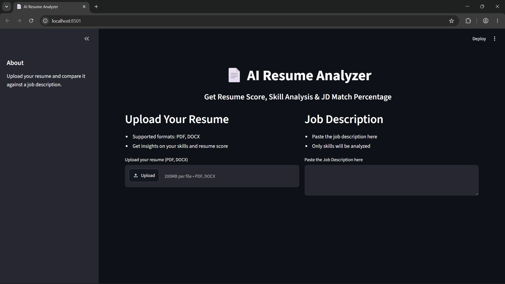
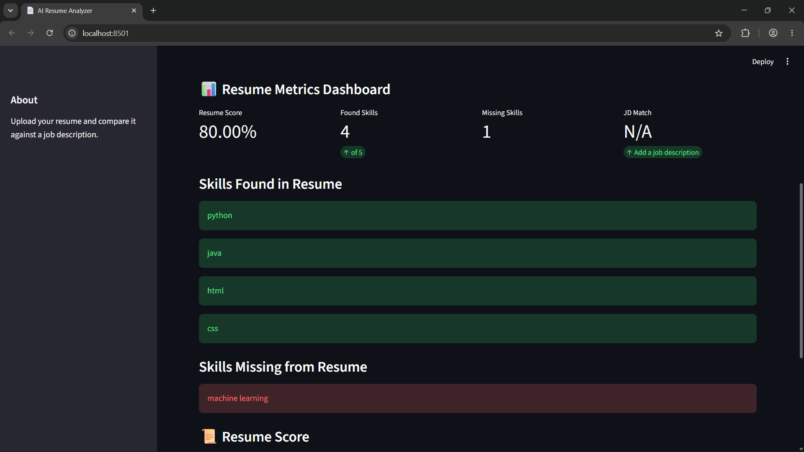
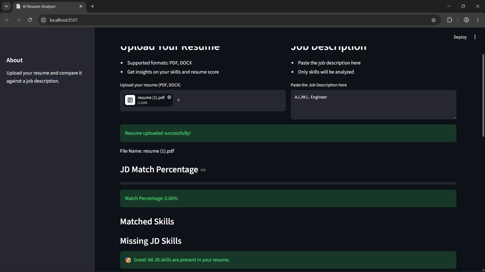
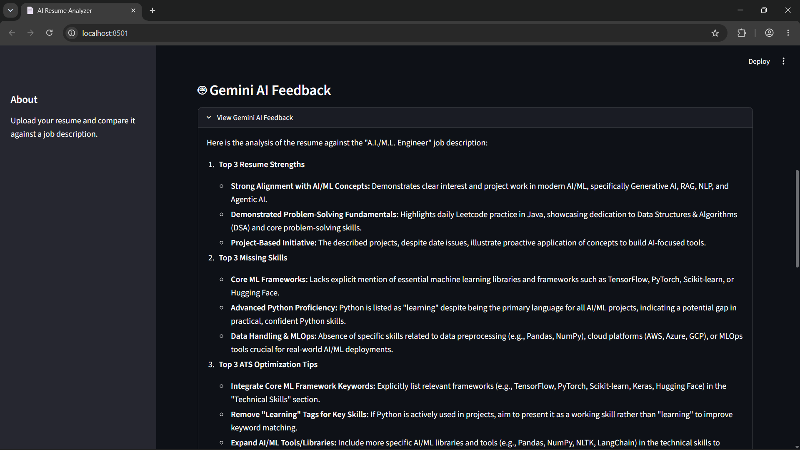

## AI Resume Analyzer

AI Resume Analyzer is a Streamlit-based application that uses Google's Gemini AI to analyze resumes, identify profession-specific skills, detect missing skills, calculate resume scores, and compare resumes against job descriptions.

## Features

- Upload PDF and DOCX resumes
- AI-powered resume analysis using Gemini
- Profession detection
- Resume skill extraction
- Profession-specific missing skill detection
- Resume score generation
- Strength and weakness analysis
- AI-generated resume feedback
- Job Description (JD) matching
- Matched skills identification
- Missing JD skills analysis
- JD match percentage calculation

## Tech Stack

- Python
- Streamlit
- Google Gemini API 
- PyPDF2
- python-docx
- JSON

Installation

pip install -r requirements.txt

Run

streamlit run app.py

## Key Capabilities

### Resume Only Mode
- Detect profession
- Extract important skills
- Identify missing profession-specific skills
- Generate resume score
- Provide AI feedback

### Resume + JD Mode
- Analyze resume against job description
- Calculate match percentage
- Show matched skills
- Show missing JD skills
- Generate targeted recommendations

Project Structure

AI-RESUME-ANALYZER
├── app.py
├── requirements.txt
├── README.md
└── .gitignore

## Screenshots

### Home Page

### Skills Analysis

### JD Match

### Gemini AI Feedback

